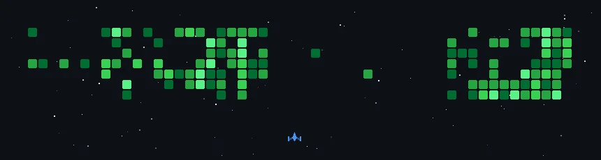

<!-- Animated Header -->
<h1 align="center">
  
</h1>

<!-- Small animated GIF -->

---

# 💫 About Me

I'm **Ramez Khaled**, a junior front-end developer passionate about building modern, fast, and beautiful web apps.  
I love writing clean code, learning new technologies, and building meaningful digital experiences.

---

## 🌐 Socials

---

# ⚡ Tech Stack

  

---

### ✍️ Random Dev Quote

---

<h2 align="center">🚀 My GitHub Journey</h2>
>>>>>>> parent of f226a73 (Merge pull request #1 from RamezKhaled77/gitskins/readme-mtisaclk)

  

Turning commits into battles. One day at a time.

---

<!-- Made with ❤️ by Ramez Khaled -->
